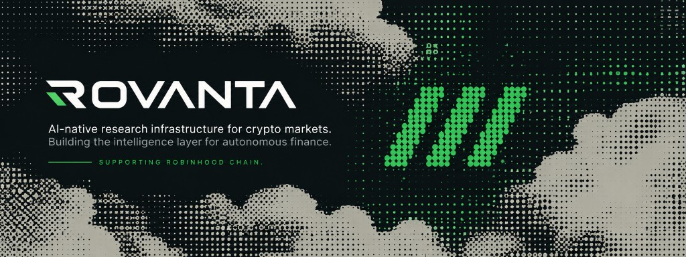
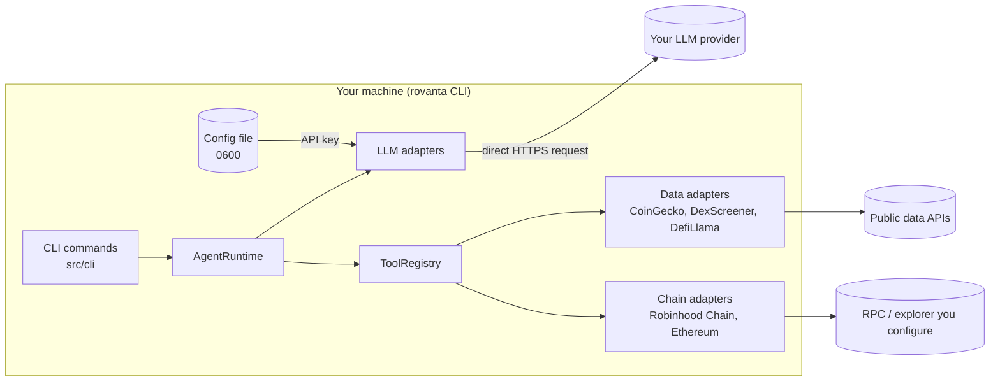
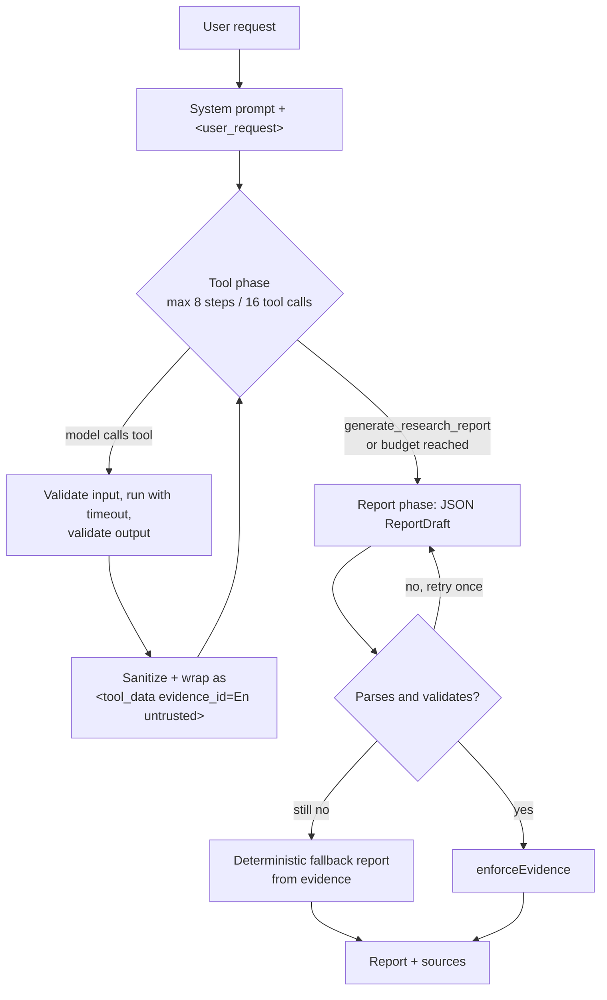

<p align="center">
  
</p>

<p align="center">
  
</p>

<h1 align="center">ROVANTA</h1>

<p align="center">
  <strong>AI research agent for Robinhood Chain &amp; Ethereum.</strong><br />
  Run locally from your terminal.
</p>

<p align="center">
  
  
  
  
  
  
</p>

<p align="center">
  <a href="#quick-start">Quick start</a> &nbsp;·&nbsp;
  <a href="#commands">Commands</a> &nbsp;·&nbsp;
  <a href="#architecture">Architecture</a> &nbsp;·&nbsp;
  <a href="#tool-development">Tools</a> &nbsp;·&nbsp;
  <a href="SECURITY.md">Security</a> &nbsp;·&nbsp;
  <a href="#roadmap">Roadmap</a>
</p>

<h3 align="center">$RVNT</h3>

<p align="center"><strong>Contract address (CA)</strong></p>

```text
0x176f35FE04441BB79FE66F41fD663A34E1D648C7
```

<p align="center">
  <a href="https://www.ponsfamily.com/launchpad/0x176f35FE04441BB79FE66F41fD663A34E1D648C7"></a>
</p>

<p align="center"><sub>Paired with ETH. Always verify the contract address. Not investment advice.</sub></p>

---

ROVANTA is a command-line research agent. It gives your AI model typed research tools, public market and on-chain data, and a structured workflow for investigating crypto markets. You bring the model and the key. The output is an evidence-linked report, printed to your terminal, in which every statement is labelled as a fact, an inference or an unknown.

| | |
| --- | --- |
| **Your model, your key** | OpenAI-compatible, Anthropic or Google. Requests go directly from your machine to your provider. There is no ROVANTA server. |
| **14 research tools** | Token, market, liquidity, protocol and on-chain tools with typed input and output schemas, validated on every call. |
| **Evidence, not guesses** | Every claim is labelled FACT, INFERENCE or UNKNOWN. Facts must cite the tool result they came from. |
| **Untrusted data stays data** | Retrieved content is sanitized and passed to the model as quoted data, never as instructions. |
| **Unix-friendly** | Progress goes to stderr, the report to stdout. Pipe it, redirect it, or ask for JSON. |
| **Initial ecosystem support** | Robinhood Chain via a configurable RPC and a pluggable `ChainAdapter`. |

> ROVANTA is research tooling. It does not provide investment advice, trading signals or price predictions. It is an independent open-source project and is not affiliated with or endorsed by Robinhood.

---

## Contents

- [What is ROVANTA?](#what-is-rovanta)
- [Why ROVANTA?](#why-rovanta)
- [Quick start](#quick-start)
- [Example session](#example-session)
- [Commands](#commands)
- [LLM setup](#llm-setup)
- [Data configuration](#data-configuration)
- [Data providers](#data-providers)
- [Robinhood Chain setup](#robinhood-chain-setup)
- [Architecture](#architecture)
- [Tool development](#tool-development)
- [Adding LLM providers](#adding-llm-providers)
- [Research reports](#research-reports)
- [Security](#security)
- [Development](#development)
- [Project structure](#project-structure)
- [Roadmap](#roadmap)
- [Disclaimer](#disclaimer)
- [License](#license)

---

## What is ROVANTA?

ROVANTA is an open-source research agent for researchers, traders, Web3 builders, analysts and other AI agents. You ask a research question from the terminal, for example `rovanta "What is the current liquidity and holder activity around token X on Robinhood Chain?"`, and an agent loop:

1. plans which data it needs,
2. calls allowlisted tools (market data, liquidity, protocol metrics, chain state, wallet activity),
3. records every tool result as numbered evidence (`E1`, `E2`, ...),
4. produces a structured report whose claims cite that evidence.

**Bring your own model.** ROVANTA does not provide inference. You configure your own provider (OpenAI-compatible, Anthropic or Google Gemini). Your API key stays on your machine and LLM requests go directly from your machine to your provider.

**What ROVANTA provides:** tools, data access, context management, orchestration, research workflows and structured outputs.

**What ROVANTA is not:** a chatbot, a signal platform, copy trading, a "100x finder", a prediction engine, or a source of investment advice.

## Why ROVANTA?

- **Evidence over narrative.** Reports separate what the data shows (FACT, with evidence ids) from interpretation (INFERENCE) and gaps (UNKNOWN). Claims without valid evidence are downgraded automatically.
- **Your model, your key.** No inference markup, no hosted service, no vendor lock-in. Switch providers with one command or flag.
- **Typed, auditable tools.** Every tool has a zod input and output schema, a timeout and structured errors. Tool outputs are validated before the model sees them.
- **Untrusted data handled as data.** External API responses are sanitized and wrapped before entering the model context, which reduces prompt-injection risk from on-chain strings and token metadata.
- **Scriptable.** Plain text, markdown or JSON output; stdin input; meaningful exit codes.
- **Extensible.** Data providers, chains, tools and LLM providers are all small interfaces.

## Quick start

Requirements: Node.js 20 or later (22+ recommended) and npm.

```bash
git clone https://github.com/Wangdev0/rovanta && cd rovanta
npm install
npm run build
npm link            # puts `rovanta` on your PATH
```

Configure your model once, then ask a question:

```bash
rovanta config init
rovanta research "What is the liquidity profile of ETH?"
```

`rovanta config init` asks for a provider, model id, base URL (if needed) and API key, and stores them in a local config file readable only by you. See [LLM setup](#llm-setup) for environment variables and other options.

During development you can run the CLI without building:

```bash
npm run dev -- research "What is the liquidity profile of ETH?"
npx tsx src/cli/bin.ts --help
```

## Example session

Illustrative only. Values such as `$X` stand in for real data; the exact layout may differ between versions.

```text
$ rovanta research "What does the DEX liquidity for token X look like?"
› provider openai-compatible · model your-model-id
› PLAN: Identify the token
› PLAN: Check market data and DEX liquidity
› Searching tokens ............................ E1  (CoinGecko)
› Fetching market data ........................ E2  (CoinGecko)
› Checking DEX liquidity ...................... E3  (DexScreener)
› Writing report
# Token X: DEX liquidity

## Overview
- [FACT] Token X trades at about $X with a 24h volume of $Y. [E2]
- [INFERENCE] Liquidity is concentrated in a small number of pools. [E3]

## Liquidity
- [FACT] Total DEX liquidity across N pools is about $Z. [E3]

## Unknowns
- [UNKNOWN] Holder distribution was not available from the configured data sources.

## Sources
- E1  CoinGecko   fetched 2026-01-01T00:00:00Z
- E2  CoinGecko   fetched 2026-01-01T00:00:00Z
- E3  DexScreener fetched 2026-01-01T00:00:00Z

Not investment advice. Verify information independently.
```

Lines starting with `›` are progress and go to stderr. Everything else is the report on stdout, so `rovanta research "..." > report.md` saves only the report.

## Commands

Run `rovanta --help` or `rovanta <command> --help` for the full reference.

| Command | Purpose |
| --- | --- |
| `rovanta research "<question>"` | Run a research job and print a sourced report. `rovanta "<question>"` is shorthand. |
| `rovanta wallet <address>` | Read-only lookup of a public address: balances and recent transactions. |
| `rovanta chain [status]` | Show the status of configured chains. |
| `rovanta tools` | List the research tools the agent can call. |
| `rovanta providers` | List supported LLM providers. |
| `rovanta config <subcommand>` | Set up and inspect your configuration. |

Global options: `-h, --help`, `-v, --version`, `--no-color`. The `NO_COLOR` environment variable is respected, and colors are disabled automatically when output is not a terminal.

### `rovanta research`

```bash
rovanta research "<question>" [options]
rovanta "<question>" [options]
echo "<question>" | rovanta research [options]
```

| Option | Description |
| --- | --- |
| `--provider <id>` | `openai-compatible`, `anthropic` or `google`. Overrides config and env. |
| `--model <id>` | Model id as your provider names it. |
| `--base-url <url>` | Provider base URL. Required for `openai-compatible`. |
| `-f, --format <fmt>` | `text` (default on a terminal), `markdown` or `json`. |
| `-o, --out <file>` | Write the report to a file instead of stdout. |
| `--max-steps <n>` | Maximum model steps in the tool phase (default 8). |
| `--max-tool-calls <n>` | Maximum tool calls per run (default 16). |
| `-q, --quiet` | Suppress progress output. |
| `--verbose` | Show more detail in progress output (tool inputs, durations). |

- When stdin is piped and no question is given, the question is read from stdin.
- Progress goes to **stderr** and the report to **stdout**, so the report can be piped or redirected.
- **Ctrl-C** cancels the running job. Press it twice to exit immediately.
- The API key is never accepted as a flag (flags end up in shell history and process lists). Use `rovanta config init` or an environment variable.

### `rovanta wallet`

```bash
rovanta wallet <address> [--chain <slug>] [--limit <n>] [--json]
```

Public, read-only data only: native balance, token balances and recent transactions. No model is involved. ROVANTA never asks for private keys or seed phrases.

### `rovanta chain`

```bash
rovanta chain [status] [--json]
```

Shows each configured chain with chain id, latest block, gas price and RPC latency, or why it is not configured.

### `rovanta tools` and `rovanta providers`

```bash
rovanta tools [--json]
rovanta providers [--json]
```

List the registered research tools (name, category, description) and the supported LLM providers (id, default base URL, whether a base URL is required).

### `rovanta config`

```bash
rovanta config init                 # interactive setup
rovanta config show                 # print the effective config (API key masked)
rovanta config set <key> <value>    # e.g. model, provider, baseUrl, COINGECKO_API_KEY
rovanta config unset <key>
rovanta config path                 # print the config file location
```

## LLM setup

ROVANTA resolves the LLM configuration in this order (later wins):

1. **Config file**, written by `rovanta config init` / `rovanta config set`.
2. **Environment variables.**
3. **Command-line flags** (`--provider`, `--model`, `--base-url`). The API key is never accepted as a flag.

**Config file location:** `$ROVANTA_CONFIG` if set, otherwise `$XDG_CONFIG_HOME/rovanta/config.json`, otherwise `~/.config/rovanta/config.json`. The file is created with mode `0600` (readable and writable only by your user).

**Environment variables:**

| Variable | Description |
| --- | --- |
| `ROVANTA_PROVIDER` | `openai-compatible`, `anthropic` or `google` |
| `ROVANTA_MODEL` | Model id |
| `ROVANTA_BASE_URL` | Provider base URL |
| `ROVANTA_API_KEY` | API key for the selected provider |
| `OPENAI_API_KEY` | Fallback key for `openai-compatible` when `ROVANTA_API_KEY` is not set |
| `ANTHROPIC_API_KEY` | Fallback key for `anthropic` |
| `GEMINI_API_KEY` or `GOOGLE_API_KEY` | Fallback key for `google` |

**Providers:**

| Provider | Default base URL | Notes |
| --- | --- | --- |
| `openai-compatible` | `https://api.openai.com/v1` | Any endpoint implementing the Chat Completions API with tool calling. Base URL is required. |
| `anthropic` | `https://api.anthropic.com` | Messages API with tool use. |
| `google` | `https://generativelanguage.googleapis.com/v1beta` | Key is sent in the `x-goog-api-key` header, not the URL. |

Base URLs must use `https`. Plain `http` is accepted only for `localhost` / `127.0.0.1`. The model id is whatever your provider calls the model; ROVANTA does not hard-code model names. The model must support tool (function) calling.

**Local models.** Servers such as Ollama or LM Studio that expose an OpenAI-compatible API work with the `openai-compatible` provider, for example:

```bash
export ROVANTA_PROVIDER=openai-compatible
export ROVANTA_BASE_URL=http://localhost:11434/v1
export ROVANTA_MODEL=your-model-id
export ROVANTA_API_KEY=placeholder   # required but unused by servers that do not check keys
```

## Data configuration

LLM settings are separate from data settings. Data-provider keys and chain endpoints are optional and can be set either as environment variables or stored in the config file with `rovanta config set <NAME> <value>`. Environment variables take precedence. The CLI does **not** load `.env` files automatically; export the variables in your shell (see [.env.example](.env.example) for the full list) or use `config set`.

| Variable | Default | Description |
| --- | --- | --- |
| `COINGECKO_API_KEY` | empty | Optional CoinGecko key. Without it, the public API and its limits apply. |
| `COINGECKO_API_PLAN` | `demo` | `demo` uses `https://api.coingecko.com/api/v3`; `pro` uses `https://pro-api.coingecko.com/api/v3`. |
| `ROBINHOOD_CHAIN_RPC_URL` | empty | JSON-RPC endpoint from the official Robinhood Chain documentation. |
| `ROBINHOOD_CHAIN_ID` | empty | Numeric chain id. |
| `ROBINHOOD_CHAIN_EXPLORER_URL` | empty | Block explorer base URL, used for source links. |
| `ROBINHOOD_CHAIN_EXPLORER_API_URL` | empty | Blockscout-compatible API base. Enables address history and token lists. |
| `ROBINHOOD_CHAIN_NATIVE_SYMBOL` | `ETH` | Native token symbol. |
| `ETHEREUM_RPC_URL` | empty | Optional Ethereum mainnet RPC endpoint. |
| `ETHEREUM_EXPLORER_URL` | empty | Optional Ethereum block explorer base URL, used for source links. |
| `ETHEREUM_EXPLORER_API_URL` | empty | Optional Blockscout-compatible API base for Ethereum. |

## Data providers

| Service | Adapter | Endpoint | Used for |
| --- | --- | --- | --- |
| Market | CoinGecko | `https://api.coingecko.com/api/v3` or `https://pro-api.coingecko.com/api/v3` | Search, metadata, price, market data, volume |
| Liquidity | DexScreener | `https://api.dexscreener.com` | DEX pairs and liquidity |
| Protocol | DefiLlama | `https://api.llama.fi` | Protocol search, TVL, metadata |
| On-chain | EVM adapters (viem) | RPC URLs you configure | Chain status, transactions, balances, contracts |
| Web research | Disabled stub | none | Placeholder; returns `DATA_UNAVAILABLE` |

All data requests go directly from your machine to these endpoints. You are responsible for complying with each data provider's terms of use and rate limits.

The CLI builds its data layer with `createServerDataServices(env)` from `src/core/data/server.ts`, which wires the adapters above from your environment and config.

### Adding a data provider

1. Implement the relevant interface from `src/core/data/types.ts` (`MarketDataProvider`, `LiquidityDataProvider`, `ProtocolDataProvider`, `OnChainDataProvider` or `WebResearchProvider`). Every method returns `{ data, sources }`, and `data` must parse with the schemas in `src/core/data/schemas.ts`. Use `null` for values the upstream does not report.
2. Wire it into `createServerDataServices(env)` in `src/core/data/server.ts`, reading any keys from `env`.
3. Add tests with recorded fixtures under `tests/fixtures/`, labelled `DEV FIXTURE`.

More detail: [docs/providers.md](docs/providers.md).

## Robinhood Chain setup

Initial ecosystem support: Robinhood Chain. ROVANTA has no affiliation with or endorsement from Robinhood.

No RPC endpoints are bundled. Get the RPC URL, chain id and explorer URLs from the official Robinhood Chain documentation and set them:

```bash
export ROBINHOOD_CHAIN_RPC_URL=<rpc-url-from-official-docs>
export ROBINHOOD_CHAIN_ID=<chain-id-from-official-docs>
export ROBINHOOD_CHAIN_EXPLORER_URL=<explorer-url>
export ROBINHOOD_CHAIN_EXPLORER_API_URL=<blockscout-compatible-api-url>   # optional
export ROBINHOOD_CHAIN_NATIVE_SYMBOL=ETH

# or store them in the config file:
rovanta config set ROBINHOOD_CHAIN_RPC_URL <rpc-url-from-official-docs>

rovanta chain status
```

- With only the RPC URL configured, chain status, blocks, transactions by hash, native and single-token balances, token metadata and contract info work.
- Address transaction history and full token balance lists need `ROBINHOOD_CHAIN_EXPLORER_API_URL`. Without it, those parts are reported as gaps (unknown), not as zero.
- If the chain is not configured, on-chain tools return `RPC_NOT_CONFIGURED`.
- RPC URLs are never included in report sources, because they may embed provider credentials.

## Architecture



Everything runs locally in one Node.js process. Your LLM key is sent only to your LLM provider; data requests go only to the fixed data endpoints and the RPC URLs you configure.

### Research loop



Only lines the model prefixes with `PLAN:` are shown as progress. ROVANTA does not display hidden chain-of-thought.

See [docs/architecture.md](docs/architecture.md) for trust boundaries and the event model.

## Tool development

Tools live in `src/core/tools/`. A tool is a typed function the model can call:

```ts
import { z } from "zod";
import { defineTool } from "@/core/tools/define";

export const getExampleTvlTool = defineTool({
  name: "get_example_tvl",
  description:
    "Get the current total value locked in USD for one protocol. tvlUsd is null when the provider does not report it, meaning unknown.",
  category: "protocol",
  activityLabel: "Checking protocol TVL",
  input: z.object({
    protocol: z.string().trim().min(1).max(100).describe("Protocol slug, e.g. as returned by search_protocols"),
  }),
  output: z.object({
    protocol: z.string(),
    tvlUsd: z.number().nullable(),
  }),
  timeoutMs: 10_000,
  async run(input, ctx) {
    const { data, sources } = await ctx.data.protocol.getProtocolMetadata(input.protocol);
    return { data: { protocol: input.protocol, tvlUsd: data.tvlUsd }, sources };
  },
  summarize(output) {
    return `${output.protocol} TVL ${output.tvlUsd ?? "unknown"}`;
  },
});
```

Provider result shapes are defined in `src/core/data/schemas.ts`.

Register it by adding it to the tool list in `src/core/tools/index.ts` (or pass it to `createDefaultRegistry([myTool])`). The registry converts the zod input schema to JSON Schema for the model. It then shows up in `rovanta tools`.

`executeTool` validates input, enforces the timeout (15 s by default), validates output, and returns structured errors. It never throws.

Guidelines:

- **Return sources.** Every result needs the `sources` it came from.
- **Use `null` for unknown.** Never substitute `0`, empty strings or guesses for missing data.
- **Validate inside `run`.** Check addresses, chain slugs and other inputs (see `src/core/security/validators.ts`) and throw a `RovantaError` with a specific code.
- **Keep outputs small.** Trim lists and long text. Large outputs crowd out evidence and are truncated by the sanitizer.
- **Describe precisely.** The description is what the model reads: state units, null semantics and limits.
- **No side effects.** Tools are read-only. No arbitrary network access, no code execution.

See [docs/tools.md](docs/tools.md) for the full tool list.

## Adding LLM providers

1. Implement `LLMProvider` from `src/core/llm/types.ts`: `generate`, `stream` and `toolCall`, mapping your provider's tool-calling format to `ToolCallRequest` and `FinishReason`.
2. Map provider errors to `RovantaError` codes (`INVALID_API_KEY`, `RATE_LIMITED`, `PROVIDER_UNAVAILABLE`, ...). Never include the API key in error messages.
3. Add the id to `ProviderId` and register a factory:

```ts
import { registerProvider } from "@/core/llm/registry";

registerProvider(
  "my-provider",
  {
    id: "my-provider",
    label: "My Provider",
    defaultBaseUrl: "https://api.example.com/v1",
    requiresBaseUrl: false,
    modelPlaceholder: "Model ID from your provider",
    docsUrl: "https://example.com/docs",
  },
  (config, fetchImpl) => createMyProvider(config, fetchImpl),
);
```

4. Add tests using a mocked `fetch`.

If the provider already exposes an OpenAI-compatible Chat Completions API, no code is needed: use `--provider openai-compatible` with its base URL.

## Research reports

Reports have these sections: Overview, Market, Liquidity, Activity, Protocol, Narrative, Developer / ecosystem signals, Potential catalysts, Risks, Unknowns, followed by Sources built from the evidence list. Use `--format markdown` for a markdown document or `--format json` for the full structured report, including evidence.

Every claim carries one label:

| Label | Meaning | Rule |
| --- | --- | --- |
| `FACT` | Directly supported by tool data | Must cite at least one valid evidence id (`E1`, ...). Otherwise it is downgraded to `INFERENCE`. Predictive statements labelled `FACT` are also downgraded. |
| `INFERENCE` | Interpretation of evidence | Should cite the evidence it is based on. |
| `UNKNOWN` | Data was missing, unavailable or contradictory | Stated explicitly rather than filled in. |

Claims that amount to hype or investment advice (buy/sell calls, price targets, guaranteed returns) are dropped. Downgraded claims are marked in the report. If the model cannot produce a valid report after one retry, ROVANTA builds a deterministic fallback report from the evidence alone and marks it as such.

## Security

- LLM API keys stay on your machine, in your environment or a `0600` config file, and are sent only to the provider you configure. Keys are never accepted as command-line flags and are masked in `rovanta config show`.
- There is no ROVANTA server and no inference proxy. Secrets are redacted from errors and progress output.
- Wallet features are read-only. ROVANTA never asks for private keys or seed phrases and never signs transactions. Execution interfaces exist only as disabled, unimplemented types.
- Tools are allowlisted, schema-validated, time-limited and budgeted. The model cannot choose arbitrary URLs, read files or run code.
- Tool data is treated as untrusted and sanitized before it reaches the model.

Read [SECURITY.md](SECURITY.md) for the full threat model and how to report a vulnerability.

## Development

```bash
npm test            # vitest run
npm run test:watch  # watch mode
npm run typecheck   # tsc --noEmit
npm run lint        # eslint
npm run build       # bundle the CLI to dist/cli.js
npm run dev -- <args>   # run the CLI from source with tsx
```

Tests run against mocked `fetch` and recorded fixtures; they do not call live APIs. CI runs lint, typecheck, tests, build and a CLI smoke test on every push and pull request. See [CONTRIBUTING.md](CONTRIBUTING.md).

## Project structure

```text
src/
  cli/
    bin.ts              Executable entry point
    index.ts            Argument dispatch and help
    io.ts               stdout / stderr / stdin abstraction, color detection
    config.ts           Config file and environment resolution
    prompt.ts           Interactive prompts (config init)
    style.ts            Terminal colors and formatting
    commands/           research, wallet, chain, tools, providers, config
    render/             Text, markdown and JSON report renderers, progress output
  core/
    agent/              Research loop, prompts, events
    chain/              ChainAdapter, EVM adapter (viem), Robinhood Chain and generic EVM config
    data/               Data provider interfaces, adapters, service wiring
    execution/          Disabled execution interfaces (types only)
    llm/                LLMProvider interface, provider adapters, registry
    report/             Report schema, validation, markdown export
    security/           Sanitization, secret redaction, validators
    tools/              defineTool, registry, executor, market/ and chain-protocol/ tools
    errors.ts           RovantaError codes
tests/                  Vitest tests and fixtures
docs/                   Architecture, tools, providers
```

## Roadmap

This roadmap describes direction, not commitments. Items under "Direction" do not exist today.

**Now**

- Terminal research agent (`rovanta`) with OpenAI-compatible, Anthropic and Gemini adapters
- 14 typed research tools across market, liquidity, protocol and on-chain data
- Evidence-linked reports with FACT / INFERENCE / UNKNOWN enforcement, as text, markdown or JSON
- Initial ecosystem support: Robinhood Chain; optional Ethereum
- Read-only wallet and chain status lookups

**Next**

- An MCP server so other agents and tools can call ROVANTA's research tools
- Additional EVM chains through the existing `ChainAdapter` interface
- A web research adapter behind `WebResearchProvider`
- Local research sessions and report history
- Published npm package
- More tests against recorded provider fixtures

**Direction**

ROVANTA is designed to grow toward the following. None of these exist today.

- Persistent research agents and event-driven research that keep monitoring tokens, protocols and wallets
- Autonomous research workflows and agent-to-agent research
- Market intelligence, portfolio intelligence and structured market memory built on the same typed tool and evidence model
- Execution infrastructure, only after an independent audit, through the `WalletProvider`, `PermissionManager` and `TransactionSimulator` interfaces. These interfaces are disabled and unimplemented today.

ROVANTA has no token. If a token is ever introduced, it would need a clearly defined utility within the software.

## Disclaimer

ROVANTA is research tooling. Nothing it produces is investment, financial, legal or tax advice. Reports are generated by a language model from third-party data that may be incomplete, delayed or wrong. Verify information independently before acting on it. Crypto assets carry substantial risk, including total loss.

## License

[MIT](LICENSE) © ROVANTA Contributors
