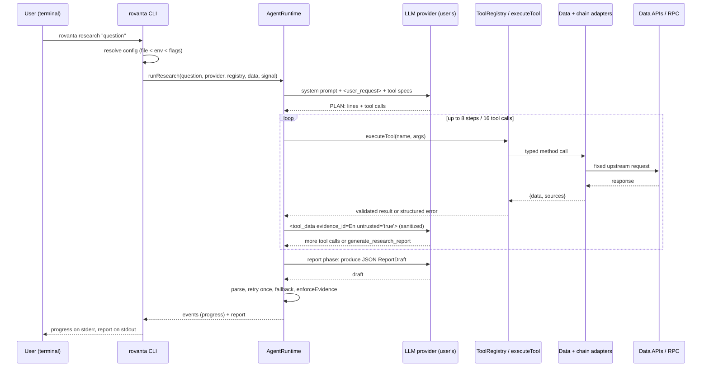
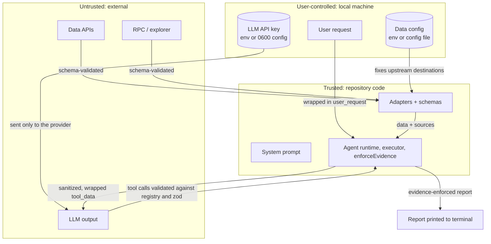

# Architecture

ROVANTA is a command-line application. Everything runs in a single local Node.js process: the CLI parses your command, resolves configuration, runs the research engine in `src/core`, and renders the result. There is no ROVANTA server. This document covers the components, data flow, trust boundaries and the agent event model.

## Components

| Layer | Location | Responsibility |
| --- | --- | --- |
| CLI entry and dispatch | `src/cli/bin.ts`, `src/cli/index.ts` | Parse global flags, route to a command, return an exit code |
| CLI I/O | `src/cli/io.ts`, `src/cli/style.ts` | stdout / stderr / stdin abstraction, TTY and color detection (`NO_COLOR`, `--no-color`) |
| Configuration | `src/cli/config.ts`, `src/cli/prompt.ts` | Config file (`0600`), environment and flag resolution, interactive `config init` |
| Commands | `src/cli/commands/*` | `research`, `wallet`, `chain`, `tools`, `providers`, `config` |
| Rendering | `src/cli/render/*` | Progress lines on stderr; text, markdown or JSON report on stdout |
| LLM adapters | `src/core/llm` | `LLMProvider` implementations for OpenAI-compatible, Anthropic and Google APIs |
| Agent runtime | `src/core/agent` | Research loop, budgets, evidence collection, event stream |
| Tools | `src/core/tools` | Typed, validated, time-limited read-only functions |
| Data services | `src/core/data/server.ts` | `createServerDataServices(env)` wires the adapters below into a `DataServices` bundle |
| Data adapters | `src/core/data/{coingecko,dexscreener,defillama,web}.ts` | Calls to public data APIs, normalized to shared schemas |
| Chain adapters | `src/core/chain` | `ChainAdapter` implementations over viem and Blockscout-compatible explorer APIs |
| Reports | `src/core/report` | Schema, validation, evidence enforcement, markdown export |
| Security | `src/core/security` | Sanitization, secret redaction, input validators |
| Execution | `src/core/execution` | Interface types only; disabled and unimplemented |

`src/core` does not depend on `src/cli`. The engine can be embedded in other frontends (for example a future MCP server) without the terminal layer.

## Data flow



## Trust boundaries



Boundary rules:

1. **CLI to LLM provider.** The only destination the API key is sent to.
2. **CLI to data upstreams.** Destinations are fixed in adapters and your configuration. Nothing the model sends selects a URL. Data requests never carry the LLM API key.
3. **Upstream to model.** Every response is schema-validated by the adapter, validated again against the tool's output schema, sanitized and wrapped as untrusted before entering the model context.
4. **Model to user.** Model output is never trusted as-is: tool calls are validated, only `PLAN:` lines are shown, and reports go through `enforceEvidence`.

## Agent loop

`runResearch` (in `src/core/agent`) has two phases.

**Tool phase.** The model receives the system prompt, the user request in `<user_request>` tags and tool specs (JSON Schema generated from zod). It may plan using `PLAN:` lines and call tools. Default limits: 8 model steps and 16 tool calls per run (`--max-steps`, `--max-tool-calls`). Each successful result receives an evidence id (`E1`, `E2`, ...) and is passed back as:

```text
<tool_data tool="get_liquidity" evidence_id="E3" untrusted="true">
{ ...sanitized JSON... }
</tool_data>
```

`sanitizeDeep` strips control and bidirectional-override characters, neutralizes sequences that could close the wrapper, flags instruction-like text in `security_flags`, and caps sizes. Tool errors are returned to the model as structured errors so it can adjust or record an unknown. The phase ends when the model calls `generate_research_report` or a budget is reached.

**Report phase.** The model is asked for a JSON `ReportDraft`. `parseReportDraft` validates it; on failure the model gets one retry. If that also fails, a deterministic report is built from the evidence. `enforceEvidence` then downgrades unsupported or predictive `FACT` claims and drops hype and advice. Sources come from recorded evidence.

**Cancellation.** The CLI passes an `AbortSignal` to the run. The first Ctrl-C aborts it (in-flight requests are cancelled and the run ends with `ABORTED`); a second Ctrl-C exits the process immediately.

## Event model

The runtime emits typed events that the CLI renders as progress lines on stderr (and includes in `--format json` output where useful). Events never contain the API key or hidden reasoning.

| Event | Emitted when | Main payload |
| --- | --- | --- |
| `run_start` | A run begins | Run id, question |
| `status` | Phase changes (planning, gathering, writing report) | Status text |
| `plan` | The model writes `PLAN:` lines | Plan steps |
| `tool_start` | A tool call begins | Call id, tool name, activity label, input |
| `tool_result` | A tool call succeeds | Call id, evidence id, summary, sources, duration |
| `tool_error` | A tool call fails | Call id, `RovantaError` code and message |
| `report` | The final report is ready | `ResearchReport` |
| `error` | The run fails (e.g. `INVALID_API_KEY`, `ABORTED`) | `RovantaError` |
| `run_end` | Always, last | Outcome: `complete`, `failed` or `aborted` |

The exact type definitions are in `src/core/agent/types.ts`.

## Errors

All layers use `RovantaError` (`src/core/errors.ts`) with a fixed set of codes: `INVALID_API_KEY`, `PROVIDER_UNAVAILABLE`, `RATE_LIMITED`, `UNSUPPORTED_PROVIDER`, `PROVIDER_NOT_CONFIGURED`, `RPC_UNAVAILABLE`, `RPC_NOT_CONFIGURED`, `INVALID_TOKEN`, `INVALID_WALLET`, `INVALID_INPUT`, `DATA_UNAVAILABLE`, `TOOL_TIMEOUT`, `MALFORMED_TOOL_RESULT`, `UNKNOWN_TOOL`, `ABORTED`, `INTERNAL`. Errors serialize to JSON for tool results and `--json` output, and their messages are safe to show to users. The CLI prints them to stderr and exits with a non-zero code.

## Execution layer

`src/core/execution` defines `WalletProvider`, `PermissionManager`, `TransactionSimulator` and `ExecutionRequest` types for a possible future execution layer. There is no implementation. `EXECUTION_ENABLED` is a hard-coded `false` constant and `getExecutionLayer()` always throws. No `EXECUTION_ENABLED` environment variable is read.
